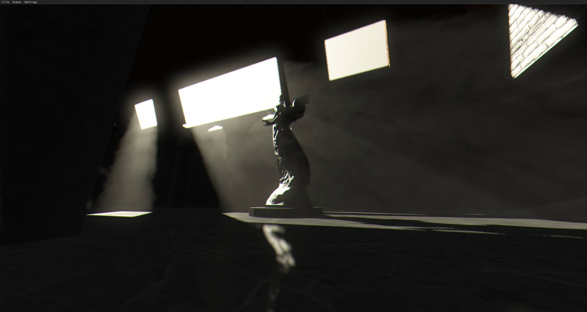

# IDK Graphics

Various video snippets showcasing this project can be found on my [youtube channel](https://www.youtube.com/channel/UCGAz01HMhGKtGDcwpWRQNbg).

| | | |
|-|-|-|
||| |
||| |
||| |


# Features
- Modern OpenGL 4.6 features (AZDO).
- GPU-side particle systems. All particle systems are updated in parallel using compute shaders.
- GPU-side skeletal animation.
- Various natural phenomena:
    - Physically-based atmosphere rendering.
    - Realistic water using fractional brownian motion.
    - Real-time terrain generation.
- Physically-based Lambertian diffuse + Cook-Torrance lighting model.
- Voxel cone tracing implementation for low-frequency global illumination.
- Various lighting and post-processing effects:
    - Screen space ambient occlusion.
    - Screen space reflections.
    - Volumetric light sources.
    - Bloom.
    - Chromatic Aberration.
    - Option for temporal accumulation of many post-processing effects.
- Concurrent asset loading.
- Engine-native binary file formats.
- Custom widget-based GUI system for in-game UI.


# Architecture


## Rendering Pipeline
On the user-facing side, IDK Graphics presents itself as an immediate-mode renderer. Internally, however, rendering is deferred until the end of the frame.


#### Render Requests
- Render requests are submitted to the rendering engine during the main loop through idk::RenderEngine::drawModel( int model, glm::mat4 M ).
- Each request to drawModel places the transformation matrix into a list of transformation matrices for the model.


#### Geometry Pass
- Render the scene geometry and depth buffer from the perspective of each camera in the scene.
- Render solid particle effects using alpha-cutoff. Effects such as fire are rendered with additive blending.
- Public interface exists for users to create their own render queue and geometry pass shaders
- Render the depth buffer for each shadow-casting light source in the scene.

#### Lighting Pass
- Lighting model (Lambertian diffuse + Cook-Torrance specular) is applied to the geometry pass data and rendered to the output texture.
- Each light source is then rendered on top of the scene using 3D proxy geometry.
- Effects such as volumetics and atmospherics are then rendered and composited on top of the output texture.

#### Post-Processing Pass
- The post-processing pass is a mix of fragment and compute shader dispatches.
- Some of the tasks in this pass run concurrently, but many rely on each other.
- Bloom, for example, require effects such as screen space reflections. UI, however, is rendered independently and composited at the end of the pass.


### Resource Management
Resources maintained and tracked by IDKGraphics are stored contiguously using custom allocators. These allocators return an int32_t handle greater than zero on the successful creation of a resource. This handle can then be used to access, modify or delete the resource.

Example of resource creation/deletion:

```C++
int model = ren.loadModel("assets/models/cube.idkvi");

std::vector<int> lights(32);

for (int i=0; i<32; i++)
{
    lights[i] = ren.createPointlight();
}

while (engine.running())
{
    for (int i=0; i<32; i++)
    {
        auto &light = ren.getPointlight(lights[i]);

        light.position.x += (rand() % 100) / 100.0f - 0.5f;
        light.position.y += (rand() % 100) / 100.0f - 0.5f;
        light.position.z += (rand() % 100) / 100.0f - 0.5f;

        if (glm::distance(light.position, glm::vec3(0.0f)) > 10.0f)
        {
            ren.destroyPointlight(lights[i]);
            lights[i] = ren.createPointlight();
        }
    }

    ren.drawModel(model, glm::mat4(1.0f));
}
```
