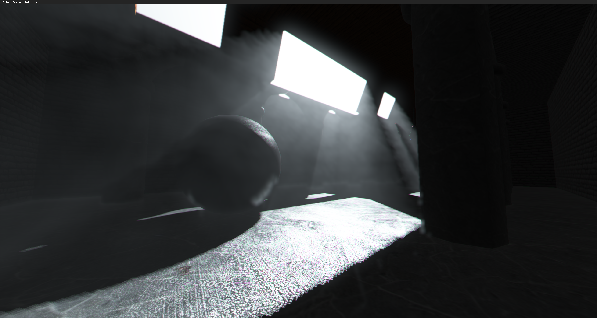
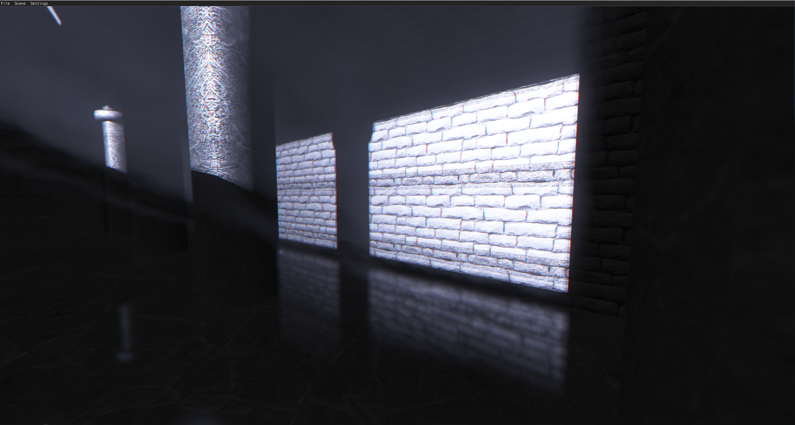
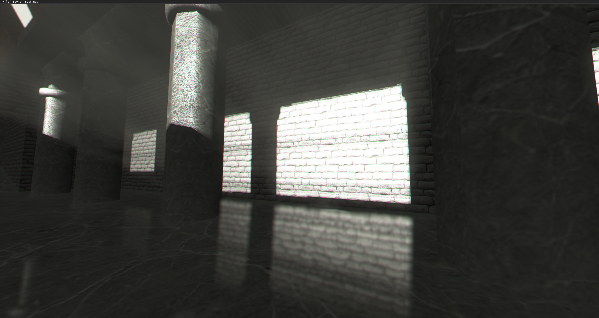
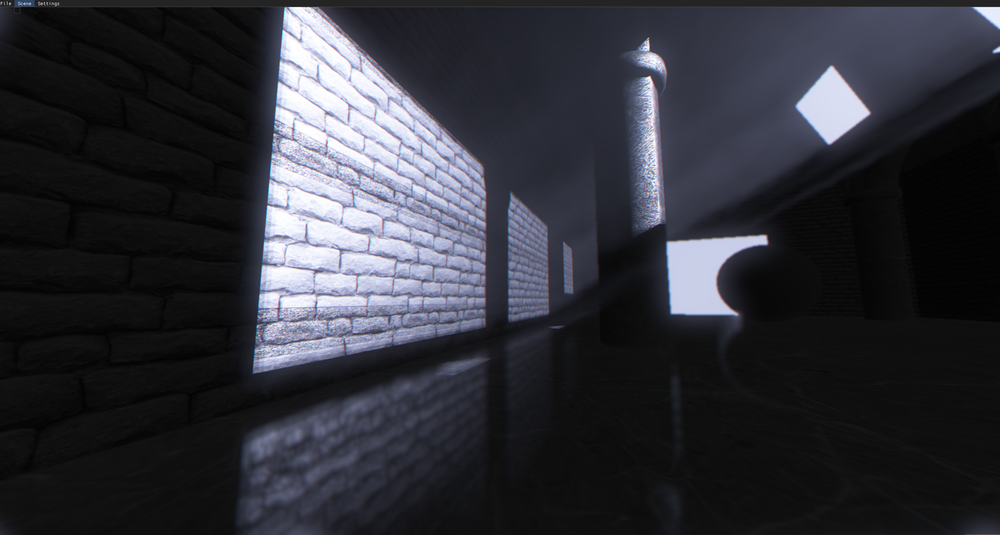
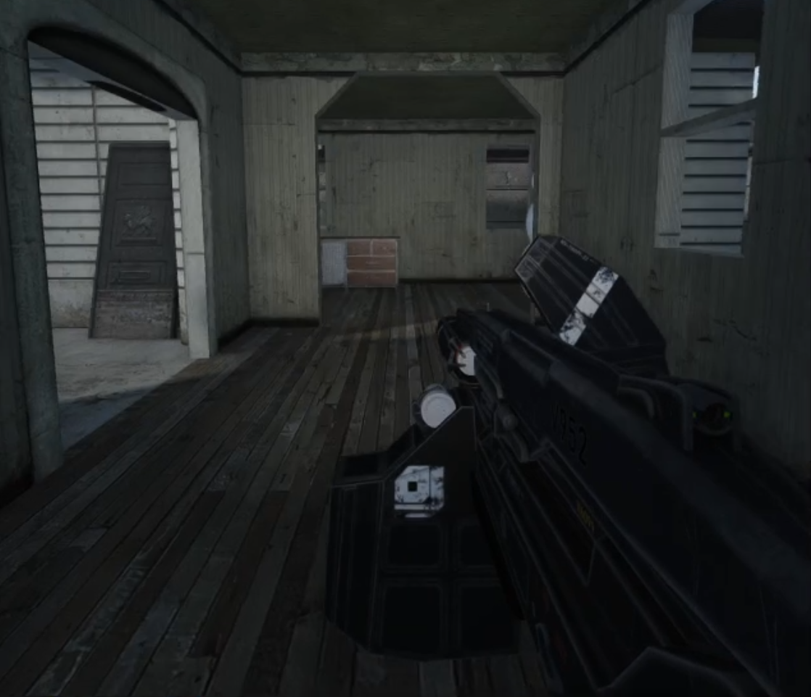

# IDK Graphics

| | | |
|-|-|-|
||| |
||| |
||| |


# Architecture


## Rendering
There are two vertex formats used internally, one for non-skinned and one for skinned meshes. The renderer maintains a set of 512 MB GPU-side buffers of each vertex format.

Each call to drawModel with the same model handle add to a list of transformation matrices for the model. At the end of the main loop, all render requests by the user are processed, culled (if trivial) and batched into a single draw call made to glMultiDrawElementsIndirect.


## Rendering Pipeline
On the user-facing side, IDK Graphics presents itself as an immediate-mode renderer. Internally, however, rendering is deferred until the end of the frame.


#### Render Requests
- Render requests are submitted to the rendering engine during the main loop through idk::Renderer::drawModel( int model, glm::mat4 M ).
- Each request to drawModel places the transformation matrix into a list of transformation matrices for the model.


#### Geometry Pass
- Render the scene geometry and depth buffer from the perspective of each camera in the scene.
- Render particle effects using alpha-cutoff.
- Public interface exists for users to create their own render queue and geometry pass shaders
- Render the depth buffer for each shadow-casting light source in the scene.

#### Lighting Pass
- Lighting model (Lambertian diffuse + Cook-Torrance specular) is applied to the geometry pass data and rendered to the output texture.
- Effects such as volumetics and atmospherics are then rendered and composited on top of the output texture.

#### Post-Processing Pass


### Resource Management
Resources maintained and tracked by IDKGraphics are stored contiguously using custom allocators (see libidk::Allocator\<T\>). These allocators (and by extension, the engine) returns an int32_t handle greater than zero on the successful creation of a resource. This handle can then be used to access, modify or delete the resource.

Example of resource creation/deletion:

```C++
int model = ren.loadModel("assets/models/cube.idkvi");

std::vector<int> lights(32);

for (int i=0; i<32; i++)
{
    lights[i] = ren.createPointlight();
}

while (engine.running())
{
    for (int i=0; i<32; i++)
    {
        auto &light = ren.getPointlight(lights[i]);

        light.position.x += (rand() % 100) / 100.0f - 0.5f;
        light.position.y += (rand() % 100) / 100.0f - 0.5f;
        light.position.z += (rand() % 100) / 100.0f - 0.5f;

        if (glm::distance(light.position, glm::vec3(0.0f)) > 10.0f)
        {
            ren.destroyPointlight(lights[i]);
            lights[i] = ren.createPointlight();
        }
    }

    ren.drawModel(model, glm::mat4(1.0f));
}
```
